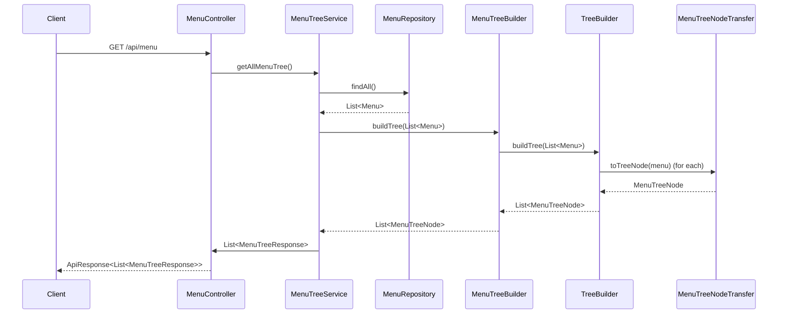

```mermaid
classDiagram
    class Menu {
        - String code
        - String name
        - String url
        - Menu parent
    }

    class MenuTreeNode {
        - String id
        - String name
        - String url
        - String parentId
        - List~MenuTreeNode~ children
    }

    class MenuTreeResponse {
        - String code
        - String name
        - String url
        - List~MenuTreeNode~ children
    }

    class TreeNode~T~ {
        <<interface>>
        +String getId()
        +String getParentId()
        +List~T~ getChildren()
    }

    class TreeNodeTransfer~E,N~ {
        <<interface>>
        +N toTreeNode(E entity)
    }

    class TreeBuilder~E,N~ {
        - TreeNodeTransfer~E,N~ transfer
        +List~N~ buildTree(List~E~ entities)
    }

    class MenuTreeNodeTransfer {
        +MenuTreeNode toTreeNode(Menu menu)
    }

    class MenuTreeBuilder {
        +List~MenuTreeNode~ buildTree(List~Menu~ entities)
    }

    class MenuTreeService {
        +List~MenuTreeResponse~ getAllMenuTree()
    }

    %% 관계 구성
    Menu --> MenuTreeNodeTransfer
    MenuTreeNodeTransfer ..|> TreeNodeTransfer~Menu, MenuTreeNode~
    TreeBuilder~Menu,MenuTreeNode~ --> TreeNodeTransfer~Menu,MenuTreeNode~
    MenuTreeBuilder --> TreeBuilder~Menu,MenuTreeNode~
    MenuTreeBuilder --> MenuTreeNodeTransfer
    MenuTreeService --> MenuRepository
    MenuTreeService --> MenuTreeBuilder
    MenuTreeService --> MenuTreeResponse
    MenuTreeResponse --> MenuTreeNode
    MenuTreeNode ..|> TreeNode~MenuTreeNode~
```

# 📂 메뉴 트리 구조 API 설계 및 구현 문서
###### 작성일: 2025.06.02
###### 기술 스택: Java, Spring Boot, JPA, RESTful API, Lombok

## ✅ 기능 개요

트리 형태의 메뉴 구조를 클라이언트에 반환하는 REST API입니다.  
각 메뉴는 부모-자식 관계로 구성되어 있으며, 이를 계층적 JSON 트리로 응답합니다.

- **요청 URL**: `GET /api/menu`
- **응답 구조**: `List<MenuTreeResponse>` (계층형 트리 구조)

---

## 🧱 계층별 클래스 구조

| 계층 | 클래스명 | 설명 |
|------|----------|------|
| Controller | `MenuController` | 클라이언트 요청 처리 및 응답 반환 |
| Service | `MenuTreeService` | 메뉴 전체 조회 및 트리 구조 반환 |
| Repository | `MenuRepository` | 메뉴 테이블 전체 조회 |
| TreeBuilder | `MenuTreeBuilder` | 메뉴 도메인에 특화된 트리 빌더 |
| Generic Tree | `TreeBuilder<E, N extends TreeNode<N>>` | 재사용 가능한 트리 빌더 구현체 |
| DTO 변환기 | `MenuTreeNodeTransfer` | `Menu` → `MenuTreeNode` 변환 수행 |
| DTO | `MenuTreeNode`, `MenuTreeResponse` | 응답용 계층 구조 정의 |

---

## 🧩 응답 예시

```json
[
  {
    "code": "ROOT01",
    "name": "시스템 관리",
    "url": "/system",
    "children": [
      {
        "code": "SYS01",
        "name": "권한 관리",
        "url": "/system/role",
        "children": []
      }
    ]
  }
]
```

## 📎 관련 파일 경로
```bash

📁 menu
 ┗ 📁 controller
    ┣ 📄 MenuController.java
 ┗ 📁 service
    ┣ 📄 MenuTreeService.java
    ┣ 📄 MenuTreeBuilder.java
 ┗ 📁 entity
    ┣ 📄 Menu.java
 ┗ 📁 dto
    ┣ 📄 MenuTreeNode.java
    ┣ 📄 MenuTreeResponse.java
    ┗ 📁 transfer
       ┗ 📄 MenuTreeNodeTransfer.java
 ┗ 📁 repository
    ┣ 📄 MenuRepository.java

📁 common
 ┣ 📁 tree
 ┃ ┣ 📄 TreeBuilder.java
 ┃ ┗ 📄 TreeNode.java
 ┗ 📁 transfer
   ┗ 📄 TreeNodeTransfer.java
```

| 원칙                       | 설계 적용 내용 (한 줄 요약)                                                                               |
| ------------------------ | ----------------------------------------------------------------------------------------------- |
| **SRP**<br>(단일 책임 원칙)    | `TreeBuilder`, `Transfer`, `Service`, `Controller` 각각 하나의 역할만 담당하도록 클래스를 분리했습니다.                |
| **OCP**<br>(개방-폐쇄 원칙)    | `TreeBuilder`는 `TreeNodeTransfer` 인터페이스를 통해 구체 구현에 의존하지 않고, 새로운 트리 노드 타입을 쉽게 확장할 수 있도록 열려 있습니다. |
| **LSP**<br>(리스코프 치환 원칙)  | `TreeNode`를 구현한 `MenuTreeNode`는 부모 인터페이스의 기대에 맞게 정상적으로 동작하며, 치환 가능성을 보장합니다.                     |
| **ISP**<br>(인터페이스 분리 원칙) | `TreeNode`, `TreeNodeTransfer` 등 필요한 메서드만 가진 작고 명확한 인터페이스로 설계되어 불필요한 의존이 없습니다.                  |
| **DIP**<br>(의존 역전 원칙)    | `TreeBuilder`는 구체 타입이 아닌 `TreeNodeTransfer` 인터페이스에 의존하고, 구체 구현은 외부에서 주입되어 유연성과 테스트 용이성을 확보했습니다. |





