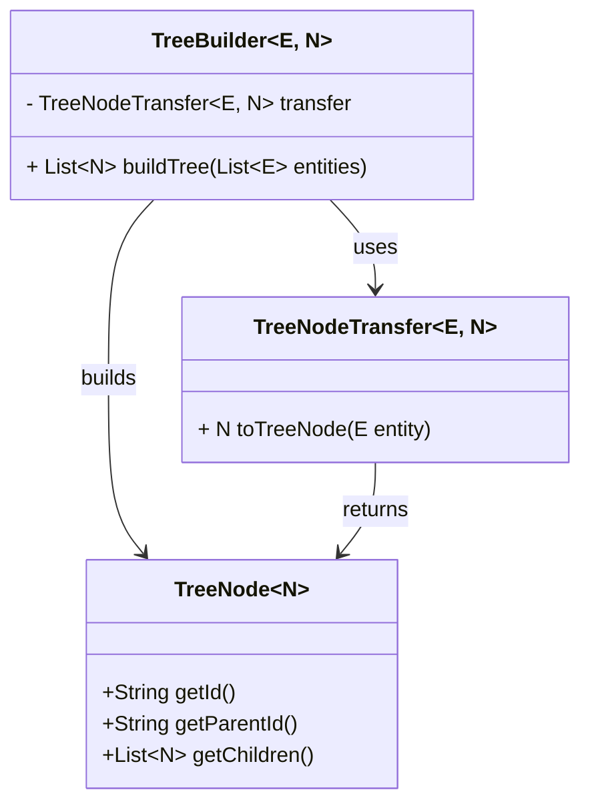
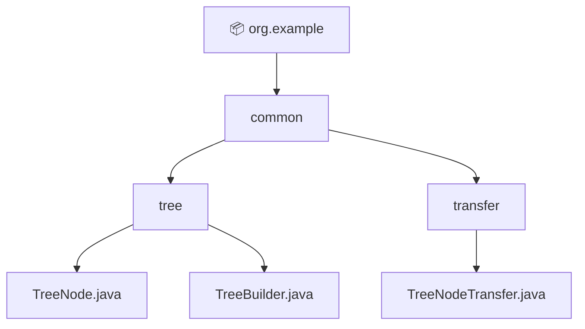
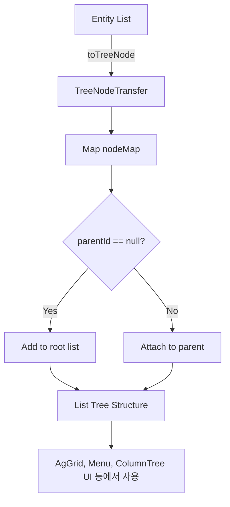

# 🌲 TreeBuilder 사용 가이드
## 🍃 공통 트리 구조 빌더 - TreeBuilder
> - 계층형 데이터를 트리 구조(List<Node>)로 변환하는 공통 유틸 클래스.
> - 부모-자식 관계를 가진 데이터를 전처리할 때 널리 사용할 수 있도록 설계됨.

## 🍃 사용법 요약(한눈에 보기)
```java
// SpecificTreeNode - TreeNode 인터페이스를 implements 한 클래스 구현체
// specificTreeBuilder - TreeBuilder 클래스를 상속받은 클래스 구현체
List<SpecificTreeNode> allTreeNodes = specificTreeBuilder.buildTree(allEntities);

// specificTreeNodeTransfer - specificTreeBuilder 를 정의할때, 
// 함께 정의하여 의존성 주입을 해주어야 하는 구현체 클래스.
// 이 구현체 클래스는 TreeNodeTransfer 인터페이스를 implements 해서 구현한다.
```

## 🍃 클래스 구성도


## 🍃 폴더/패키지 구조


## 전체 흐름도


## 🍃 핵심 클래스/인터페이스 설명
### 🍂 class TreeBuilder<E, N extends TreeNode<N>>
- `List<N> buildTree(List<E> entities)`:
    - flat 형태의 `모든 엔티티`를 담은 데이터 목록(List<E>)을 `TreeNode로 변환`한 뒤,
    - parentId 기준으로 자식 노드를 연결해 `트리 형태(TreeNode)의 리스트(List<TreeNode>)로 반환`합니다.
> 사용 조건
> - E: 원본 데이터 타입
> - N: 트리 노드 타입이며 `TreeNode<N>`을 상속해야 함
> - `TreeNodeTransfer<E, N>` 구현체 필요

### 🍂 interface TreeNode<N>
> What is this?
> - 트리 구조를 구성하기 위해 `노드가 갖춰야 할 기본 형식(form)`을 정의한 공통 인터페이스.
> - 이 인터페이스는 `TreeBuilder<E, N>`의 `buildTree()` 메서드에서 트리 구조를 만들기 위한 기반이 된다.
> - 트리 구조를 적용하려는 모든 엔티티는 TreeBuilder와 함께 사용하기 위해 `TreeNode<N> 인터페이스를 구현한 전용 TreeNode 구현체 클래스를 정의`해야만 한다.
- `String getId()`: 고유 식별자 (`id`)
- `String parentId()`: 부모 식별자 (`parentId`)
- `List<N> getChildren()`: 자식 노드 리스트 (`list of children`)

### 🍂 interface TreeNodeTransfer<E, N>
> What is this?
> - Entity → TreeNode 구현체로 변환하는 전략 인터페이스.
> - `TreeBuilder<E, N>`은 이 인터페이스의 구현체를 통해 Entity → Node로 매핑합니다.
- `N toTreeNode(E entity)`:
  - 트리 구조로 변환하기 위해, E entity → N treeNode 로 변환
