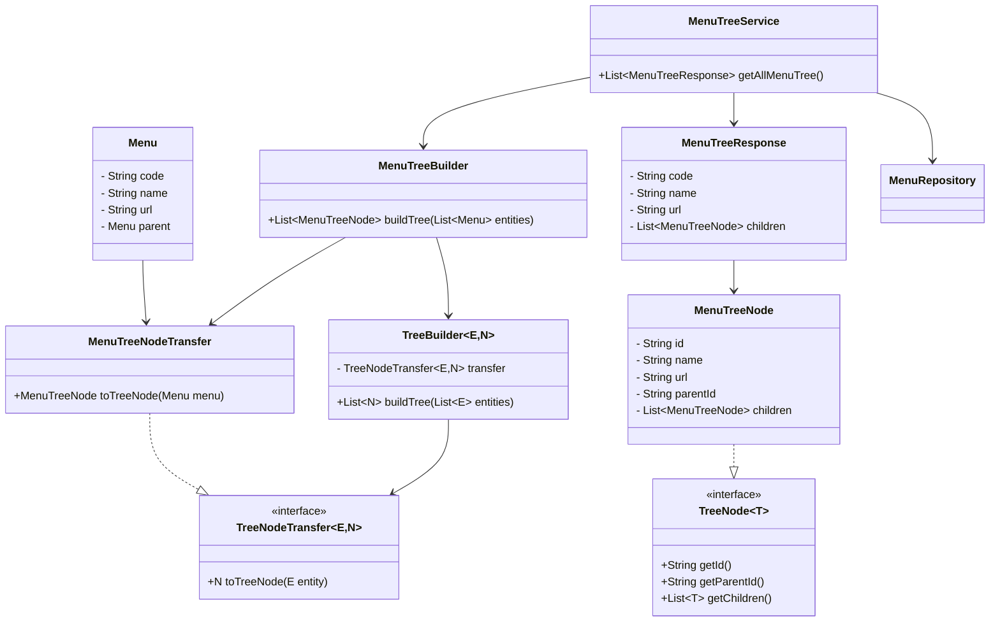
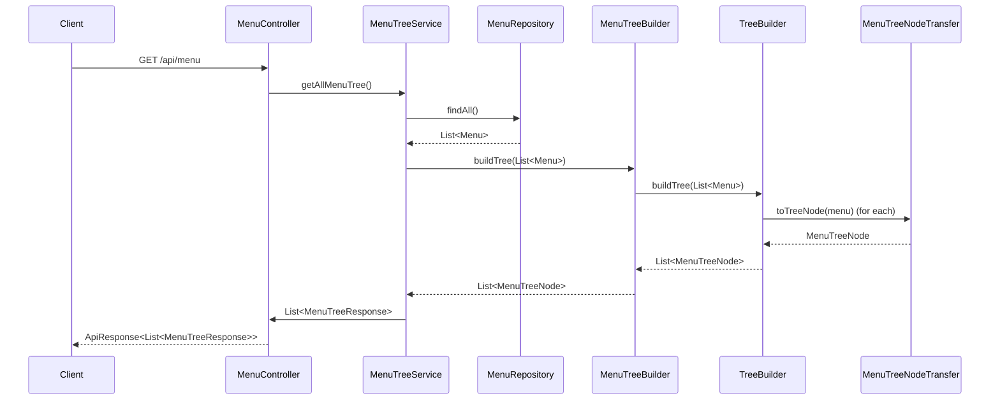

# 📂 메뉴 트리 구조 API 설계 ë° êµ¬í˜„ 문서
###### ì‘성ì¼: 2025.06.02
###### 기술 스íƒ: Java, Spring Boot, JPA, RESTful API, Lombok

## ✅ 기능 개요

트리 í˜•íƒœì˜ ë©”ë‰´ 구조를 í´ë¼ì´ì–¸íŠ¸ì— 반환하는 REST APIì…니다.  
ê° ë©”ë‰´ëŠ” 부모-ìì‹ ê´€ê³„ë¡œ 구성ë˜ì–´ ìˆìœ¼ë©°, ì´ë¥¼ ê³„ì¸µì  JSON 트리로 ì‘답합니다.

- **요청 URL**: `GET /api/menu`
- **ì‘답 구조**: `List<MenuTreeResponse>` (계층형 트리 구조)

---

## 🧱 계층별 í´ë˜ìŠ¤ 구조

| 계층 | í´ë˜ìŠ¤ëª… | 설명 |
|------|----------|------|
| Controller | `MenuController` | í´ë¼ì´ì–¸íŠ¸ 요청 처리 ë° ì‘답 반환 |
| Service | `MenuTreeService` | 메뉴 ì „ì²´ 조회 ë° íŠ¸ë¦¬ 구조 반환 |
| Repository | `MenuRepository` | 메뉴 í…Œì´ë¸” ì „ì²´ 조회 |
| TreeBuilder | `MenuTreeBuilder` | 메뉴 ë„ë©”ì¸ì— íŠ¹í™”ëœ íŠ¸ë¦¬ ë¹Œë” |
| Generic Tree | `TreeBuilder<E, N extends TreeNode<N>>` | ì¬ì‚¬ìš© 가능한 트리 ë¹Œë” êµ¬í˜„ì²´ |
| DTO 변환기 | `MenuTreeNodeTransfer` | `Menu` → `MenuTreeNode` 변환 수행 |
| DTO | `MenuTreeNode`, `MenuTreeResponse` | ì‘답용 계층 구조 ì •ì˜ |

---

## 🧩 ì‘답 예시

```json
[
  {
    "code": "ROOT01",
    "name": "시스템 관리",
    "url": "/system",
    "children": [
      {
        "code": "SYS01",
        "name": "권한 관리",
        "url": "/system/role",
        "children": []
      }
    ]
  }
]
```

## 📠관련 íŒŒì¼ ê²½ë¡œ
```bash

📠menu
 ┗ 📠controller
    ┣ 📄 MenuController.java
 ┗ 📠service
    ┣ 📄 MenuTreeService.java
    ┣ 📄 MenuTreeBuilder.java
 ┗ 📠entity
    ┣ 📄 Menu.java
 ┗ 📠dto
    ┣ 📄 MenuTreeNode.java
    ┣ 📄 MenuTreeResponse.java
    ┗ 📠transfer
       ┗ 📄 MenuTreeNodeTransfer.java
 ┗ 📠repository
    ┣ 📄 MenuRepository.java

📠common
 ┣ 📠tree
 ┃ ┣ 📄 TreeBuilder.java
 ┃ ┗ 📄 TreeNode.java
 ┗ 📠transfer
   ┗ 📄 TreeNodeTransfer.java
```



```mermaid
classDiagram
    class Menu {
        - String code
        - String name
        - String url
        - Menu parent
    }

    class MenuTreeNode {
        - String id
        - String name
        - String url
        - String parentId
        - List~MenuTreeNode~ children
    }

    class MenuTreeResponse {
        - String code
        - String name
        - String url
        - List~MenuTreeNode~ children
    }

    class TreeNode~T~ {
        <<interface>>
        +String getId()
        +String getParentId()
        +List~T~ getChildren()
    }

    class TreeNodeTransfer~E,N~ {
        <<interface>>
        +N toTreeNode(E entity)
    }

    class TreeBuilder~E,N~ {
        - TreeNodeTransfer~E,N~ transfer
        +List~N~ buildTree(List~E~ entities)
    }

    class MenuTreeNodeTransfer {
        +MenuTreeNode toTreeNode(Menu menu)
    }

    class MenuTreeBuilder {
        +List~MenuTreeNode~ buildTree(List~Menu~ entities)
    }

    class MenuTreeService {
        +List~MenuTreeResponse~ getAllMenuTree()
    }

    %% 관계 구성
    Menu --> MenuTreeNodeTransfer
    MenuTreeNodeTransfer ..|> TreeNodeTransfer~Menu, MenuTreeNode~
    TreeBuilder~Menu,MenuTreeNode~ --> TreeNodeTransfer~Menu,MenuTreeNode~
    MenuTreeBuilder --> TreeBuilder~Menu,MenuTreeNode~
    MenuTreeBuilder --> MenuTreeNodeTransfer
    MenuTreeService --> MenuRepository
    MenuTreeService --> MenuTreeBuilder
    MenuTreeService --> MenuTreeResponse
    MenuTreeResponse --> MenuTreeNode
    MenuTreeNode ..|> TreeNode~MenuTreeNode~
```


```mermaid
sequenceDiagram
    participant Client
    participant MenuController
    participant MenuTreeService
    participant MenuRepository
    participant MenuTreeBuilder
    participant TreeBuilder
    participant MenuTreeNodeTransfer

    Client->>MenuController: GET /api/menu
    MenuController->>MenuTreeService: getAllMenuTree()
    MenuTreeService->>MenuRepository: findAll()
    MenuRepository-->>MenuTreeService: List<Menu>

    MenuTreeService->>MenuTreeBuilder: buildTree(List<Menu>)
    MenuTreeBuilder->>TreeBuilder: buildTree(List<Menu>)
    TreeBuilder->>MenuTreeNodeTransfer: toTreeNode(menu) (for each)
    MenuTreeNodeTransfer-->>TreeBuilder: MenuTreeNode
    TreeBuilder-->>MenuTreeBuilder: List<MenuTreeNode>
    MenuTreeBuilder-->>MenuTreeService: List<MenuTreeNode>

    MenuTreeService->>MenuController: List<MenuTreeResponse>
    MenuController-->>Client: ApiResponse<List<MenuTreeResponse>>
```
